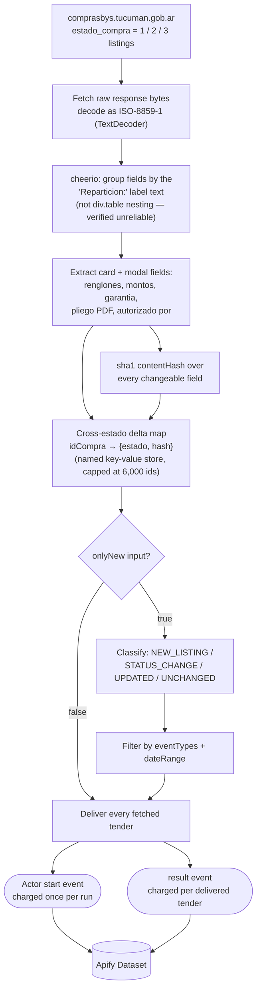

<div align="center">

# Tucuman Argentina Licitaciones — Tender Delta API

**Delta-tracked monitor for the Province of Tucuman, Argentina's public procurement portal — every licitacion, concurso de precios and contratacion directa, across upcoming, in-adjudication and awarded stages — runs on your own configured Apify schedule.**

[](https://apify.com)
[](#cost--byok-disclosure)
[](https://www.typescriptlang.org/)
[](./LICENSE)

[](https://apify.com/stefano_seggio/tucuman-compras-monitor)

Live and public at [apify.com/stefano_seggio/tucuman-compras-monitor](https://apify.com/stefano_seggio/tucuman-compras-monitor). Owner reference: [Console](https://console.apify.com/actors/TdJtze8dfyykMj2qA) · Actor ID `TdJtze8dfyykMj2qA`

</div>

---

## What it does

Tucuman's provincial procurement portal (`comprasbys.tucuman.gob.ar`) is the primary public record of every **Argentina government tender** — licitaciones publicas, licitaciones privadas, concursos de precios and contrataciones directas — issued by the province's ministries and organisms. The catch: the portal splits every tender across three separate, unlinked listings (upcoming opening, in-adjudication, awarded) with no changelog and no way to tell what changed since you last checked. Anyone tracking **Tucuman public procurement** — a supplier watching a `reparticion`, a bid consultant managing several clients, a journalist studying award patterns — is stuck re-reading pages of listings by hand just to spot the one new opening or one quietly amended budget.

This actor fetches full multi-renglon detail for every tender — buying organism, rubro, montos, opening date, pliego PDF — from all three lifecycle stages in one pass, and its delta engine tracks each `idCompra` across stages so a scheduled run reports only what is genuinely new, has moved to a new stage (`STATUS_CHANGE`), or was amended in place (`UPDATED`). Everything needed to act on a tender — including the direct pliego PDF link — ships inline in the same record; there is no separate detail-page fetch on this source, so nothing is missed and nothing costs extra to enrich.

It runs as a standard Apify Actor on your own configured Apify Scheduler — there is no fixed operator-side cadence — with Pay-Per-Event pricing: you pay only for the tenders actually delivered to your dataset, on top of a fixed per-run start fee — nothing for pages fetched, ids tracked, or runs that turn up no changes.

## Cost & BYOK Disclosure

| Event | Price | Charged when |
| --- | --- | --- |
| `result` | **$0.003** | Once per tender delivered to your dataset |
| Actor start | fixed per-run fee | Once per run, regardless of how many tenders are delivered |

Every delivered record already carries full modal-level detail — renglones, montos, garantia, pliego link — at identical extraction cost, so there is no separate cheaper "listing-only" tier: the table above is the full price list. A tender's `contentHash` (SHA-1, computed over every changeable field) is recomputed on each run; when it matches the hash stored from the last run the tender is classified `UNCHANGED` and is suppressed before delivery — it is **never billed**. You pay only for tenders this actor actually delivers on a given run; a scheduled `onlyNew` run that finds nothing new or changed costs nothing beyond the fixed per-run start fee.

> **Note on the figure above:** Delta Registry's fleet-wide pricing index currently carries a `$0` placeholder for this Actor pending independent re-verification of that page against the live Store listing; the `$0.003/result` figure here is this Actor's own real, current Pay-Per-Event price and is the authoritative one.

**No third-party API key required.** BYOK status: **none**. This Actor calls only Tucuman's own public procurement portal — there is no paid third-party API in the pipeline, and no key of any kind for you to supply.

## Quickstart

Get an API token from [console.apify.com/settings/integrations](https://console.apify.com/settings/integrations). All three examples below run the real, public Actor (`stefano_seggio/tucuman-compras-monitor`, Actor ID `TdJtze8dfyykMj2qA` — either identifier works).

### cURL (instant, synchronous)

Runs synchronously and returns the resulting dataset items directly in the response — no polling needed.

```bash
curl -X POST "https://api.apify.com/v2/acts/TdJtze8dfyykMj2qA/run-sync-get-dataset-items?token=<YOUR_API_TOKEN>" \
  -H "Content-Type: application/json" \
  -d '{
  "maxItems": 50,
  "onlyNew": true
}'
```

### Python (`apify_client`)

```python
# run_monitor.py
# Runs the Tucuman Compras Monitor actor and prints delivered tender records.
import os
from apify_client import ApifyClient

client = ApifyClient(os.environ["APIFY_TOKEN"])

run_input = {
    "estados": ["1", "2"],
    "maxItems": 50,
    "onlyNew": True,
    "eventTypes": ["NEW_LISTING", "STATUS_CHANGE", "UPDATED"],
}

run = client.actor("stefano_seggio/tucuman-compras-monitor").call(run_input=run_input)

dataset_items = client.dataset(run["defaultDatasetId"]).list_items().items
for item in dataset_items:
    print(f"- [{item['event_type']}] {item['idCompra']} | {item['reparticion']} | {item['tipoCompra']}")
```

### Node.js (`apify-client`)

```javascript
import { ApifyClient } from 'apify-client';

const client = new ApifyClient({ token: process.env.APIFY_TOKEN });

const input = {
  estados: ['1', '2'],
  maxItems: 50,
  onlyNew: true,
  eventTypes: ['NEW_LISTING', 'STATUS_CHANGE', 'UPDATED'],
};

const run = await client.actor('stefano_seggio/tucuman-compras-monitor').call(input);
const { items } = await client.dataset(run.defaultDatasetId).listItems();

for (const item of items) {
  console.log(`- [${item.event_type}] ${item.idCompra} | ${item.reparticion} | ${item.tipoCompra}`);
}
```

Full, runnable copies of the Node.js and Python examples above live in this repo under [`examples/`](examples) (`run-monitor.js`, `run_monitor.py`).

## Architecture



## Features

| Feature | Description |
| --- | --- |
| Three-stage coverage | Fetches upcoming (`estado=1`), in-adjudication (`estado=2` — 3,700+ historical records), and awarded (`estado=3`) tenders from one actor and one input |
| Full detail inline | Every record already includes `renglones`, montos, `garantiaOfertaExigida`, `pliegoPdfUrl` and more — no separate detail-page fetch exists on this source, so nothing is fetched twice |
| Delta mode (`onlyNew`) | Cross-estado lifecycle tracking per `idCompra`, persisted in this actor's own named key-value store so scheduled runs survive between executions |
| Event classification | `NEW_LISTING`, `STATUS_CHANGE` (a real lifecycle transition, e.g. upcoming → awarded, with `previousEstado` set), `UPDATED` (an amendment caught via sha1 `contentHash`), or `UNCHANGED` |
| `eventTypes` filter | Narrows delta-mode delivery to just the event kinds you care about |
| `dateRange` filter | Restricts to tenders whose `fechaAperturaSobres` falls in the last 24h / 7d / 30d — meaningful on estados 2 and 3 (estado 1's opening date is always in the future by definition) |
| Correct charset decoding | The portal serves `ISO-8859-1` but Node's native `fetch().text()` always assumes UTF-8; this actor reads raw bytes and decodes explicitly to avoid mangled accented text |
| Fail-loud structural extraction | Throws if the number of tender modals doesn't match the number of parsed field-groups on a page, rather than silently mispairing one tender's fields with another's |

## Use this from Claude Desktop, Cursor, or Windsurf (via MCP)

This Actor is also reachable as an MCP tool through Apify's own hosted `@apify/actors-mcp-server`, scoped to just this one Actor via a `?tools=` query string — not the full fleet. Get a token from [Apify Console → Settings → Integrations](https://console.apify.com/settings/integrations) first.

**Claude Desktop** (`%APPDATA%\Claude\claude_desktop_config.json` on Windows, `~/Library/Application Support/Claude/claude_desktop_config.json` on macOS) — uses the `mcp-remote` stdio bridge. Note: `mcp-remote` does not expand shell environment variables inside the JSON string, so paste the literal token in place of `${APIFY_TOKEN}` below, and keep this file out of version control.

```json
{
  "mcpServers": {
    "delta-registry-tucuman-compras-monitor": {
      "command": "npx",
      "args": [
        "-y",
        "mcp-remote",
        "https://mcp.apify.com/?tools=stefano_seggio/tucuman-compras-monitor",
        "--header",
        "Authorization: Bearer ${APIFY_TOKEN}"
      ]
    }
  }
}
```

**Cursor** (`.cursor/mcp.json` or `~/.cursor/mcp.json`) — native HTTP transport:

```json
{
  "mcpServers": {
    "delta-registry-tucuman-compras-monitor": {
      "url": "https://mcp.apify.com/?tools=stefano_seggio/tucuman-compras-monitor",
      "headers": {
        "Authorization": "Bearer ${APIFY_TOKEN}"
      }
    }
  }
}
```

**Windsurf** (`~/.codeium/windsurf/mcp_config.json`) — uses `serverUrl`, not `url`. Windsurf's `${env:...}` syntax genuinely does resolve from the environment, unlike Claude Desktop's config above:

```json
{
  "mcpServers": {
    "delta-registry-tucuman-compras-monitor": {
      "serverUrl": "https://mcp.apify.com/?tools=stefano_seggio/tucuman-compras-monitor",
      "headers": {
        "Authorization": "Bearer ${env:APIFY_TOKEN}"
      }
    }
  }
}
```

Want the full 28-actor fleet in one closed-scope config instead of just this Actor? See [`MCP_INTEGRATION.md`](https://github.com/stefanoseggio/delta-registry-website/blob/main/MCP_INTEGRATION.md) in the `delta-registry-website` repo.

## Input & Output Schema

### Input

Fields as defined in [`.actor/input_schema.json`](.actor/input_schema.json):

| Field | Type | Default | Description |
| --- | --- | --- | --- |
| `estados` | array | `["1"]` | Procurement states to fetch: `1` upcoming opening, `2` in adjudication, `3` awarded |
| `maxItems` | integer | `100` | Hard cap on tenders returned this run, across all selected states — the portal lists 5 per page and `estado=2` alone holds 3,700+ records, so start small |
| `onlyNew` | boolean | `false` | Delta mode: returns only tenders new, transitioned, or amended since a previous run |
| `eventTypes` | array | all three | Which of `NEW_LISTING` / `STATUS_CHANGE` / `UPDATED` to deliver when `onlyNew` is on |
| `dateRange` | string | _(none)_ | `"24h"` / `"7d"` / `"30d"`, filtered on `fechaAperturaSobres`, independent of `onlyNew` |

### Output

One real record from this Actor's own dataset, matching `.actor/dataset_schema.json` (trimmed for length — see the full field table below for the 8 additional fields, e.g. `renglones`, `pliegoPdfUrl`, not shown in this particular record):

```json
{
  "idCompra": "TUC-2026-04521",
  "estadoCompra": "2",
  "estadoCompraLabel": "En evaluacion",
  "reparticion": "Ministerio de Salud Publica",
  "tipoCompra": "Licitacion Publica",
  "rubro": "Insumos medicos",
  "numeroExpediente": "E-4521-2026",
  "numeroConvocatoria": "22/2026",
  "primerRenglon": "Guantes de latex, caja x 100 unidades",
  "valorPliego": "0,00",
  "presupuestoOficial": "3.200.000,00",
  "fechaAperturaSobres": "22/09/2026 10:00",
  "record_id": "TUC-2026-04521",
  "event_type": "STATUS_CHANGE",
  "scraped_at": "2026-09-15T14:11:47.000Z",
  "is_new": false,
  "previousEstado": "1",
  "contentHash": "9d2a5c8e1f4b7d03a8f1e6c9b2d45071c8e3f6b9",
  "source_url": "https://comprasenlinea.tucuman.gov.ar/"
}
```

| Field | Description |
| --- | --- |
| `idCompra` | The portal's own unique tender identifier — the key this Actor's delta engine tracks across estados. |
| `estadoCompra` / `estadoCompraLabel` | Current lifecycle stage code and its human-readable label. |
| `reparticion` | The buying government organism/ministry. |
| `tipoCompra` | Procurement type (Licitacion Publica, Licitacion Privada, Concurso de Precios, Contratacion Directa). |
| `rubro` | Category/industry of the tender. |
| `numeroExpediente` / `numeroConvocatoria` | The portal's own file/expediente and convocatoria numbers. |
| `primerRenglon` | The first line-item description. |
| `renglones` | Full array of line items, each with `renglon` (item number) and `descripcion`. |
| `valorPliego` | Price of the bidding document (pliego), as published. |
| `presupuestoOficial` | Official budget for the tender, as published. |
| `garantiaOfertaExigida` | Bid guarantee (garantía de oferta) amount required, as published; `null` when not specified. |
| `fechaAperturaSobres` | Bid-opening date/time. |
| `fechaAdjudicacion` | Award date; `null` until the tender reaches `estadoCompra = 3` (awarded). |
| `lugarApertura` | Where bids are opened, as published; `null` when not specified. |
| `informesAdquisicionPliegos` | Where/how to obtain the pliego (bidding document), as published; `null` when not specified. |
| `autorizadoPor` | Authorizing official/resolution, as published; `null` when not specified. |
| `objetoLibre` | Free-text object/subject of the tender, when the portal publishes one separately from `primerRenglon`. |
| `pliegoPdfUrl` | Direct link to the pliego PDF, when the portal publishes one; `null` otherwise. |
| `record_id` | Stable identifier for this record (mirrors `idCompra`). |
| `event_type` | `NEW_LISTING`, `STATUS_CHANGE`, `UPDATED`, or `UNCHANGED`. |
| `scraped_at` | UTC timestamp this record was captured. |
| `is_new` | `true` on a tender's first-ever appearance in the dataset. |
| `previousEstado` | Populated only on `STATUS_CHANGE` — the estado this tender was in last time it was seen. |
| `contentHash` | SHA-1 fingerprint over every changeable field, used to detect `UPDATED` amendments. |
| `source_url` | The Tucuman procurement portal's base URL. |

## Why not just scrape it yourself

- **Zero infrastructure** — no server, container, or cron box to keep patched and running just to poll a government listing page on a schedule.
- **Managed scheduling** — Apify's built-in scheduler handles recurring runs, retries, and run history without you wiring up your own job runner.
- **No proxy or session babysitting** — the portal is fetched directly with retrying, backing-off HTTP requests; there's no login, cookie jar, or rotating proxy pool to maintain for a public listing page.
- **Built-in delta and change detection** — the cross-estado lifecycle map and sha1 `contentHash` amendment detection already exist here; replicating `STATUS_CHANGE` vs. `UPDATED` classification yourself means re-solving the same state-tracking problem this actor already handles.

## Known limitations

- **Source data quality is disclosed, not silently patched.** At least one live tender was found with a field genuinely truncated on the government's own portal (`lugarApertura` cutting off mid-word); this actor extracts exactly what the source publishes rather than guessing at missing text.
- **`dateRange` has no effect on `estado=1` by design.** Upcoming tenders' `fechaAperturaSobres` is always in the future, so a backward-looking date window can never match there — it only filters meaningfully on estados 2 and 3.
- **No migration from the v1 delta state.** Upgrading a scheduled task from the v1 per-estado tracking to the current cross-estado engine re-baselines on its first run rather than migrating old state, since the two shapes cannot be reconciled.
- **No contractual enterprise SLA.** This is an independently developed and maintained actor, not a vendor-backed enterprise product; there is no guaranteed uptime commitment attached to it today.

## Contributing & Local Setup

The real, buildable TypeScript source for this Actor **is** checked into this repository (`src/`, `test/`, `package.json`) — this is not a thin documentation wrapper. To run it locally:

```bash
git clone https://github.com/stefanoseggio/tucuman-compras-monitor.git
cd tucuman-compras-monitor
npm install
apify login          # paste your Apify API token
apify run             # runs the Actor locally against src/main.ts, using .actor/input_schema.json defaults
```

`npm test` runs the test suite under `test/`. `npx tsc --noEmit` type-checks the project against `tsconfig.json`. Local runs still hit the real, live Tucuman government portal — there is no bundled fixture/mock server — so be considerate with `maxItems` while developing. Bug reports and pull requests against `src/` are welcome via GitHub issues/PRs on this repository; behavioral changes are also reflected in the Actor's Store listing on the next `apify push`.

## Node.js example

See [`run-monitor.js`](examples/run-monitor.js) — authenticates via `APIFY_TOKEN`, calls the actor, and prints each delivered tender.

## Python example

See [`run_monitor.py`](examples/run_monitor.py) — same call pattern using the `apify-client` PyPI package.

---

### About Delta Registry

`tucuman-compras-monitor` is part of **Delta Registry** — pay-per-event regulatory & compliance data infrastructure, built as a fleet of delta-tracked monitoring actors on Apify. For professional inquiries or enterprise licensing, reach out on [LinkedIn](https://www.linkedin.com/in/stefanoseggio-deltaregistry); for the rest of the fleet, see [github.com/stefanoseggio](https://github.com/stefanoseggio).
